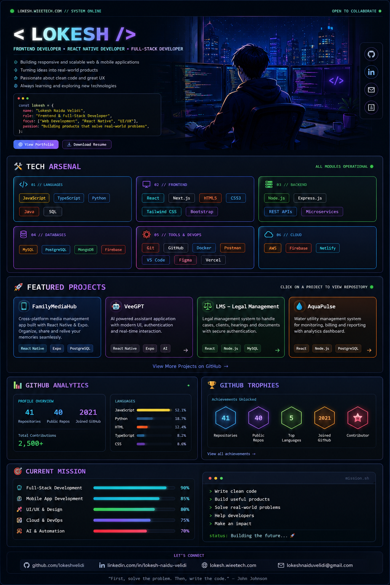

# Hi 👋, I'm Lokesh Naidu Velidi

### Frontend Developer • React Native Developer • Full-Stack Developer

Building modern, responsive, and scalable web and mobile applications.

 

 

### 🚀 Turning ideas into real-world applications

I enjoy building clean, reusable, scalable, and user-friendly applications using modern web and mobile technologies.

---

## 💻 About Me

- 🔭 Currently working on **Web and Mobile Application Development**
- 🌱 Continuously learning and improving my **Full-Stack Development** skills
- 📱 Building cross-platform mobile applications using **React Native & Expo**
- ⚛️ Creating modern web applications using **React.js**
- 🎯 Focused on writing clean, reusable, and maintainable code
- 💡 Passionate about turning ideas and designs into real-world applications

---

### 🤝 Connect With Me

 

⭐ **Thanks for visiting my GitHub profile!**

